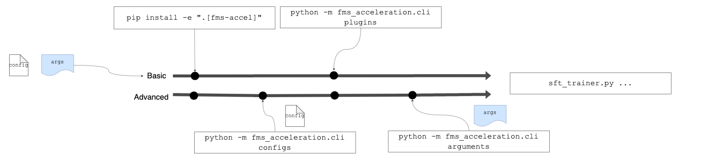

# FMS Acceleration 🚀

FMS Acceleration is designed to accelerate the fine-tuning and training of large models. This framework comprises a collection of libraries
intended to be used with the [fms-hf-tuning](https://github.com/foundation-model-stack/fms-hf-tuning) suite.

The fms-acceleration framework includes accelerators for Full and Parameter Efficient Fine Tuning (PEFT), including

 - Low Rank Adaptation (LoRA) acceleration (coming soon)
 - Bits-and-Bytes (BNB) quantised LoRA : QLoRA acceleration
 - AutoGPTQ quantised LoRA : GPTQ-LoRA acceleration
 - Full Fine Tuning acceleration (coming soon)

Our tests show a significant increase in training token throughput using this fms-acceleration framework.


For example:

- QLoRA: 22-43 % token throughput increase on 1 GPU as compared to using Hugging Face BNB QLoRA
- QLoRA: Straightforward integration with multiple GPU as compared to using Hugging Face BNB QLoRA
- GPTQ-LoRA: 22-44 % token throughput increase on 1 GPU as compared to using Hugging Face BNB QLoRA 
- GPTQ-LoRA: Straightforward integration with multiple GPU as compared to using Hugging Face BNB QLoRA

*The above includes numbers using fusedOps-and-kernels and actual impl coming soon, see below*.

**This package is in BETA and is under development. Expect breaking changes!**

## Plugins

Plugin | Description | Depends | License | Status
--|--|--|--|--
[framework](./plugins/framework/README.md) | This acceleration framework for integration with huggingface trainers | | | Beta
[accelerated-peft](./plugins/accelerated-peft/README.md) | For PEFT-training, e.g., 4bit QLoRA. | Huggingface<br>AutoGPTQ | Apache 2.0<br>MIT | Beta
[fused-op-and-kernels](./plugins/fused-ops-and-kernels/README.md)  | Fused LoRA and triton kernels (e.g., fast cross-entropy, rms, rope) | -- | Apache 2.0 [(contains extracted code)](./plugins/fused-ops-and-kernels/README.md#code-extracted-from-unsloth)| Beta
 MOE-training-acceleration  | [MegaBlocks](https://github.com/databricks/megablocks) inspired triton Kernels and acclerations for Mixture-of-Expert models |  | Apache 2.0 | Coming Soon

## Usage with FMS HF Tuning

Below we demonstrate how to accelerate your tuning experience with [tuning/sft_trainer.py](https://github.com/foundation-model-stack/fms-hf-tuning/blob/main/tuning/sft_trainer.py) from `fms-hf-tuning`. 

### Example: Accelerated GPTQ-LoRA Training

Below we illustrate accelerated quantised PEFT using GPTQ-LoRA tuning with the AutoGPTQ `triton_v2` kernel; this kernel is state-of-the-art [provided by `jeromeku` on Mar 2024](https://github.com/AutoGPTQ/AutoGPTQ/pull/596):

There is both a *basic* and *advanced* usage low



#### Basic Flow 🤡

Most users of `fms-hf-tuning` only require the basic flow:
- Assumption 1: user has an already prepared configuration, say from [fms-hf-tuning/fixtures](https://github.com/foundation-model-stack/fms-hf-tuning).
- Assumption 2: user knows exactly what acceleration 'plugins` are required (based on the configuration).
- Assumption 3: the arguments for running `sft_trainer.py` is the same; save for one extra argument `--acceleration_framework_config_file` used to pass in the acceleration config.

In this case then the basic flow comprises of 3 steps:
1. First go to [fms-hf-tuning](https://github.com/foundation-model-stack/fms-hf-tuning) and install the [framework library](./plugins/framework):
    ```
    $ pip install -e .[fms-accel]
    ```
    or alternatively install the framework directly:
    ```
    $ pip install git+https://github.com/foundation-model-stack/fms-acceleration.git#subdirectory=plugins/framework
    ```

    The above installs the command line utility `fms_acceleration.cli`, which is used to install plugins (and also other things like view sample configurations). 

3. `install` the required framework plugins; we install the `fms-acceleration-peft` plugin for GPTQ-LoRA tuning with triton v2 as:
    ```
    python -m fms_acceleration.cli install fms_acceleration_peft
    ```
    The above is the equivalent of:
    ```
    pip install git+https://github.com/foundation-model-stack/fms-acceleration.git#subdirectory=plugins/accelerated-peft
    ```

5. Run `sft_trainer.py` providing the acceleration configuration and arguments; given the basic flow assumption that we simply re-use the same `sft_trainer.py` arguments as we had without using the `fms_acceleration` package:
    ```
    # when using sample-configurations, arguments can be referred from
    # defaults.yaml and scenarios.yaml
    python sft_trainer.py \
        --acceleration_framework_config_file framework.yaml \
        ...  # arguments
    ```

    The framework activates relevant plugins given the framework configuration; for more details [see framework/README.md](./plugins/framework/README.md#configuration-of-plugins).

    Activate `TRANSFORMERS_VERBOSITY=info` to see the huggingface trainer printouts and verify that `AccelerationFramework` is activated!

    ```
    # this printout will be seen in huggingface trainer logs if acceleration is activated
    ***** FMS AccelerationFramework *****
    Active Plugin: AutoGPTQAccelerationPlugin. Python package: fms_acceleration_peft. Version: 0.0.1.
    ***** Running training *****
    Num examples = 1,549
    Num Epochs = 1
    Instantaneous batch size per device = 4
    Total train batch size (w. parallel, distributed & accumulation) = 4
    Gradient Accumulation steps = 1
    Total optimization steps = 200
    Number of trainable parameters = 13,631,488
    ```

**New exciting [plugins](#plugins) will be added, so please check here for the latest accelerations!**.

#### Advanced Flow 🥷 🦹

The advanced flow makes further use of `fms_acceleration.cli` to: 
* list all available configs and acceleration plugins the configs depend on. 
* list all available plugins and check which are the installed ones.
* identify critical `sft_trainer` arguments required for correct operation of a particular framework config.

The advanced flow comprises of 5 steps:
1. Same as Step 1 of basic flow.
2. Use `fms_acceleration.cli configs` to search for sample configs:
    ```
    $ python -m fms_acceleration.cli configs

    1. accelerated-peft-autogptq (accelerated-peft-autogptq-sample-configuration.yaml) - plugins: ['accelerated-peft']
    2. accelerated-peft-bnb (accelerated-peft-bnb-nf4-sample-configuration.yaml) - plugins: ['accelerated-peft']
    ```

    This is equivalent to the searching over the:
    * [Full sample configuration list](./sample-configurations/CONTENTS.yaml) that shows `plugins` required for all available configs.
    * E.g., [Accelerated GPTQ-LoRA configuration here](sample-configurations/accelerated-peft-autogptq-sample-configuration.yaml). 
3. `install` plugins same as Step 2 of basic flow, noting that in addition we can use `plugins` to display all available plugins; this list updates [as more plugins get developed](#plugins). Recall that `configs` list the required `plugins` for the sample configurations; make sure all of them are installed.
    ```
    $ python -m fms_acceleration.cli plugins

    Choose from the list of plugin shortnames, and do:
    * 'python -m fms_acceleration.cli install <pip-install-flags> PLUGIN_NAME'.

    List of PLUGIN_NAME [PLUGIN_SHORTNAME]:

    1. fms_acceleration_peft [peft]
    ```
    After `install` the list will update to indicate the installed plugins.
4. Get the correct arguments for `sft_trainer.py`: 
    
    * arguments required for correct operation (e.g., if using accelerated peft, then `peft_method` is required).

        * Use `arguments` along with the [sample configuration `shortname`](./sample-configurations/CONTENTS.yaml) to display the relevant *critical arguments*; these arguments can be manually referred from [scenarios.yaml](./scripts/benchmarks/scenarios.yaml):
        ```
        $ python -m fms_acceleration.cli arguments accelerated-peft-autogptq

        Searching for configuration shortnames: ['accelerated-peft-autogptq']
        1. scenario: accelerated-peft-gptq
        configs: accelerated-peft-autogptq
        arguments:
            --learning_rate 2e-4 \
            --fp16 True \
            --torch_dtype float16 \
            --peft_method lora \
            --r 16 \
            --lora_alpha 16 \
            --lora_dropout 0.0 \
            --target_modules ['q_proj', 'k_proj', 'v_proj', 'o_proj']
        ```

    * More info on `defaults.yaml` and `scenarios.yaml` [found here](./scripts/benchmarks/README.md#benchmark-scenarios).
        * Arguments *not critical to the plugins* found in [defaults.yaml](./scripts/benchmarks/defaults.yaml). These can be taken with liberty.
        * Arguments *critcal to plugins* found in [scenarios.yaml](./scripts/benchmarks/scenarios.yaml). The relevant section of [scenarios.yaml](./scripts/benchmarks/scenarios.yaml), is the one whose `framework_config` entries, match the `shortname` of the sample configuration of [interest](./sample-configurations/CONTENTS.yaml).

### CUDA Dependencies

This repo requires CUDA to compute the kernels, and it is convinient to use [NVidia Pytorch Containers](https://docs.nvidia.com/deeplearning/frameworks/support-matrix/index.html) that already comets with CUDA installed. We have tested with the following versions:
- `pytorch:24.01-py3`

### Benchmarks

The benchmarks can be reproduced [with the provided scripts](./scripts/benchmarks). 
- includes baseline benches (e.g., standard fine-tuning, standard peft).
- benches for various [acceleration sample configs](./sample-configurations/CONTENTS.yaml).

See below CSV files for various results:
- [A100-80GB](./scripts/benchmarks/refs/a100_80gb.csv).

### Code Architecture

For deeper dive into details see [framework/README.md](./plugins/framework/README.md).


## Maintainers

IBM Research, Singapore
- Fabian Lim flim@sg.ibm.com
- Aaron Chew aaron.chew1@sg.ibm.com
- Laura Wynter lwynter@sg.ibm.com
