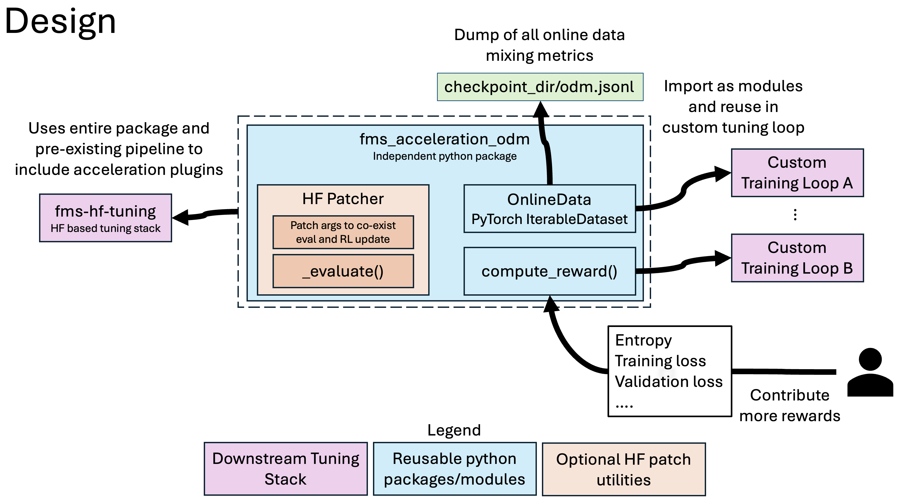
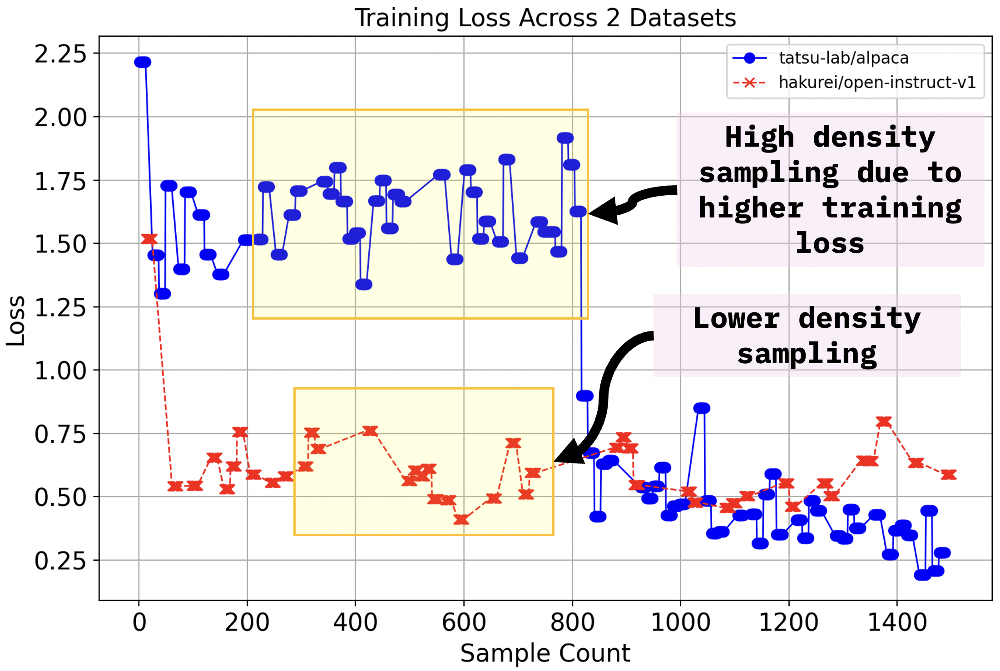

# Online Data Mixing

This library contains plugin for online dynamic reward (learnable) based data mixing framework that operates on dynamically mixing datasets online during training while being adapted based on the signals (e.g. training loss, gradnorm etc) from training.

## Plugins

Plugin | Description | Depends | Loading | Augmentation | Callbacks
--|--|--|--|--|--
[odm](./src/fms_acceleration_odm/framework_plugin_odm.py) | OnlineMixingDataset PyTorch IterableDataset and custom rewards | | ✅ | ✅ | ✅

## Design


## Usage in Custom Training Loop



`OnlineMixingDataset` can be imported easily and integrated into existing training loops with minimal changes. A sample custom training loop implementation can be found [here](./artifacts/custom_loop_usage.py). Given code sample uses two instruction tuning datasets and trains `ibm-granite/granite-3.1-2b-instruct` model for next token prediction task.

### Automatic Categorization

When only a single dataset (without category splits) is passed, the dataset will be embedded with a sentence-transformer model and clustered (K-Means by default) to build pseudo categories used by the online data mixer.

```python
from datasets import load_dataset
from fms_acceleration_odm import OnlineMixingDataset

dataset = load_dataset("tatsu-lab/alpaca", split="train[:1%]")
collator = ...  # e.g., DataCollatorForLanguageModeling(...)

odm_dataset = OnlineMixingDataset(
    dataset_dict=dataset,
    collators_dict={"train": collator},
    eval_dataset_dict={},
    eval_collators_dict={},
    auto_categorize_config={
        "input_column": "text",
        "num_categories": 6,
        "model_name": "sentence-transformers/all-MiniLM-L6-v2",
    },
)
```

Without an explicit `num_categories`, a heuristic based on the square root of the dataset size is used. Additional knobs such as `category_prefix`, `batch_size`, or clustering-specific kwargs can also be provided through `auto_categorize_config`.

## Metrics

All metrics related to the online data mixing will be logged to `odm.jsonl` file in the checkpoint output directory.

Metric | Description
--|--
`samples_produced_so_far` | Total samples produced by the dataset so far at the time of logging.
`sampling_interval` | Takes sample count "n" as input. At every "n" steps category/dataset chosen by weighted random sampling where weights are provided by the Multi-Armed Bandit algorithm.
`total_categories` | Total categories or datasets involved in mixing.
`current_sampling_weights` | Current state of the sampling weights at the time of logging.
`current_sampling_ratio` | Current state of the sampling ratios at the time of logging.
`arm_idx` | Last sampled category index. Categories/datasets are sorted in ascending order based on their names and index starts from 0 and each index corresponds to respective category/dataset.
`category_level_counts_so_far` | Split of sample count across datasets so far at the time of logging.
`rewards` | State of the rewards at the time of logging. Essentially are the last provided rewards across datasets.
`action` | Type of action took place at the time logging. It is either "update" or "sample" which correspond to weight update of the MAB algorithm or category sampling.

## Rewards

Below are the currently available rewards and we are constantly looking to improve the existing rewards and also add new ones. Further, we encourage users to identify rewards that can help their usecases.

Rewards | Description
--|--
`ENTROPY` | Calculation of shannon entropy of the logits averaged across all the tokens. Higher entropy would mean model requires more samples from that datasets/category.
`ENTROPY3_VARENT1` | 3 parts of shannon entropy and 1 part of variance of the entropy. Higher values mean requirement of more samples.
`ENTROPY_LAST_TOKEN` | Shannon entropy of the last token in the sample. Higher values mean requirement of more samples.
`TRAIN_LOSS` | Training loss where loss is maintained across categories and is updated based on the latest loss and sampled dataset/category. Higher values mean requirement of more samples.
`VALIDATION_LOSS` | Validation loss across categories calculated using evaluation datasets from each of the categories. Higher values mean requirement of more samples.
`GRADNORM` | Gradient norm where norms are maintained across categories and are updated based on the latest values and sampled dataset/category. Higher values mean reducing samples from that particular dataset/category.

### Adding a Custom Reward

Custom rewards can be added to the `compute_reward` function and adding it to the `Reward` enum. If the custom reward requires specific set of information from the training loop then `_extract_information_from_state_for_reward` function has to be extended for extracting such information from trainer state. This is member function of `OnlineMixingDataset`.

### Planned TODOs

Please see issue [#153](https://github.com/foundation-model-stack/fms-acceleration/issues/153).
